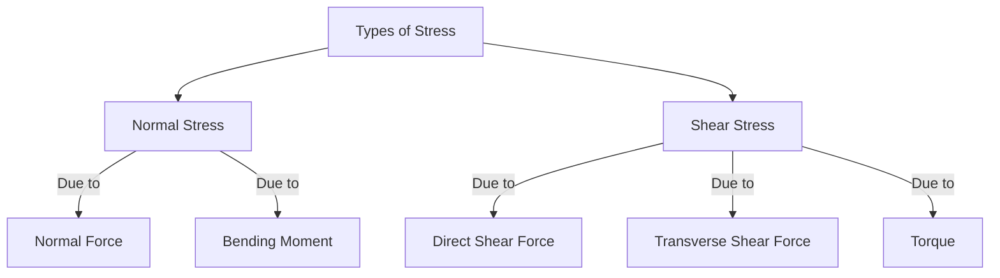

> - A load is applied on the material
> - The material tries to resist this load, which then generates [[stress]] within the material
> - That stress is the resistance of the material to being torn apart by the load
> - A material could be torn apart either perpendicular to its cross-section or parallel to its cross-section
> - Stress that resists being torn apart perpendicular to the cross-section of the material is *[[Normal Stress]]*
> - Stress that resists being torn apart parallel to the cross-section of the material is *[[Shear Stress]]*

![[Introduction#^926a74]]