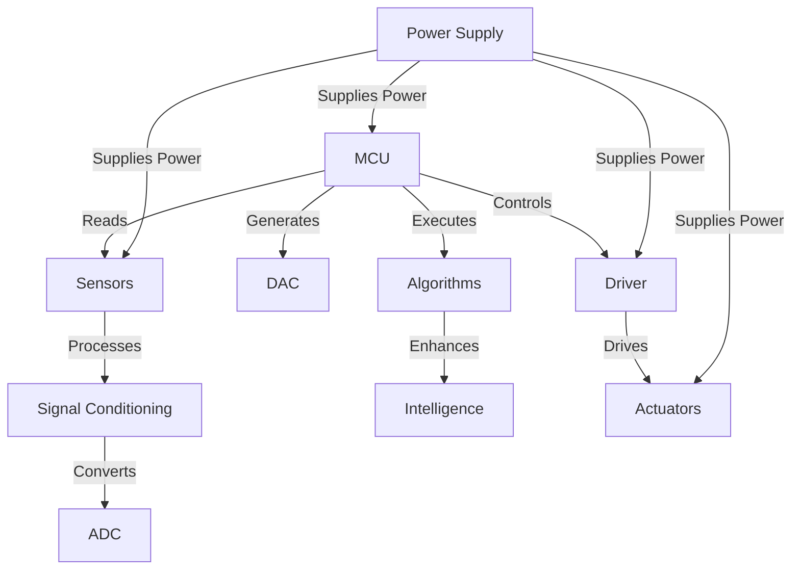

- PS / thinking process / mindset
- Adaptivity / $L^3$ (life long learning)
- Thinking / interaction / how to debug / team work / writing skills / project management / ***marketing*** / ***finance and economics*** / transferable skills
- $\boxed{\text{Broader perspective}}$
- Engineer + soft skills => best product owner
- Understand companies hierarchy
- Online courses
- Training centers
- Extra knowledge + extra skills + value => top-notch applicant
- Control isn't about code; it's about principles; code is just a language to express those principles to MCU
- See where what you study fits within this:

- You apply this to do things